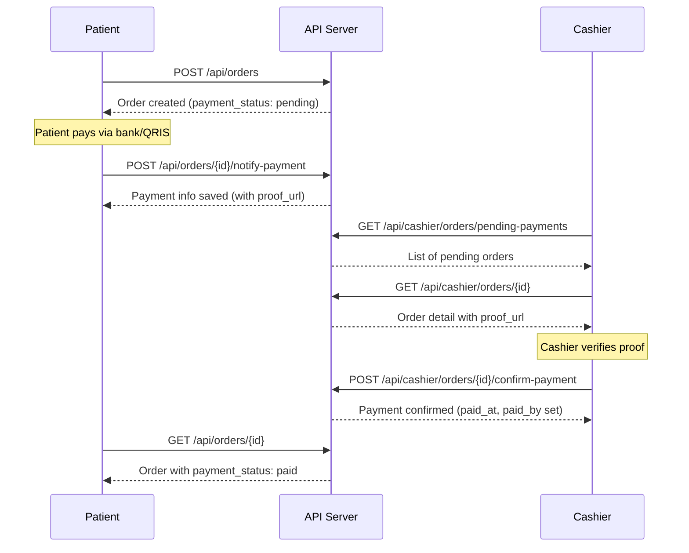

# API Contract — Laravel API Apotek

> **Version:** 1.0.0  
> **Last Updated:** 2025-12-31  
> **Base URL:** `http://localhost:8000/api`

---

## Table of Contents

1. [Authentication](#authentication)
2. [User Roles](#user-roles)
3. [Orders API](#orders-api)
   - [Create Order](#create-order)
   - [List My Orders](#list-my-orders)
   - [Get Order Detail](#get-order-detail)
   - [Cancel Order](#cancel-order)
   - [Notify Payment](#notify-payment)
4. [Cashier API](#cashier-api)
   - [List All Orders](#list-all-orders)
   - [List Pending Payments](#list-pending-payments)
   - [Get Order Detail (Cashier)](#get-order-detail-cashier)
   - [Confirm Payment](#confirm-payment)
5. [Data Models](#data-models)
6. [Error Codes](#error-codes)
7. [Flow Diagrams](#flow-diagrams)

---

## Authentication

Semua endpoint yang memerlukan autentikasi harus menyertakan header:

```
Authorization: Bearer <token>
```

Token didapat dari endpoint `POST /api/login`.

---

## User Roles

| Role | Description |
|------|-------------|
| `patient` | User biasa yang bisa membuat order dan mengirim bukti pembayaran |
| `cashier` | Staff yang bisa melihat semua order dan mengkonfirmasi pembayaran |

---

## Orders API

### Create Order

Membuat order baru dengan satu atau lebih item obat.

```
POST /api/orders
```

**Headers:**
```
Authorization: Bearer <token>
Content-Type: application/json
```

**Request Body:**

```json
{
  "items": [
    { "obat_id": 1, "quantity": 2 },
    { "obat_id": 3, "quantity": 1 }
  ],
  "shipping_address": "Jl. Contoh No. 123, Jakarta",
  "payment_method": "bank_transfer"
}
```

| Field | Type | Required | Description |
|-------|------|----------|-------------|
| `items` | array | Yes* | Array of items to order |
| `items[].obat_id` | integer | Yes | ID of the medicine |
| `items[].quantity` | integer | Yes | Quantity to order (min: 1) |
| `shipping_address` | string | No | Delivery address. Falls back to user's profile address if not provided |
| `payment_method` | string | No | Payment method: `cash`, `bank_transfer`, `qris`, `cod` |
| `payment_details` | object | No | Additional payment metadata |

> *Backward compatible: Bisa juga kirim `obat_id` + `quantity` langsung untuk single item

**Success Response (201):**

```json
{
  "success": true,
  "message": "Order berhasil dibuat",
  "data": {
    "id": 1,
    "user_id": 1,
    "total_price": 150000,
    "status": "pending",
    "shipping_address": "Jl. Contoh No. 123, Jakarta",
    "payment_method": "bank_transfer",
    "payment_status": "pending",
    "payment_details": null,
    "paid_at": null,
    "paid_by": null,
    "created_at": "2025-12-31T10:00:00.000000Z",
    "updated_at": "2025-12-31T10:00:00.000000Z",
    "items": [
      {
        "id": 1,
        "order_id": 1,
        "obat_id": 1,
        "quantity": 2,
        "unit_price": 50000,
        "subtotal": 100000,
        "obat": {
          "id": 1,
          "name": "Paracetamol",
          "price": 50000,
          "stock": 98
        }
      },
      {
        "id": 2,
        "order_id": 1,
        "obat_id": 3,
        "quantity": 1,
        "unit_price": 50000,
        "subtotal": 50000,
        "obat": {
          "id": 3,
          "name": "Amoxicillin",
          "price": 50000,
          "stock": 49
        }
      }
    ]
  }
}
```

**Error Responses:**

| Status | Message | Condition |
|--------|---------|-----------|
| 400 | `Stok tidak mencukupi` | Stock tidak cukup |
| 400 | `Obat tidak ditemukan` | obat_id tidak valid |
| 422 | `Shipping address required` | Tidak ada alamat di request maupun profile |
| 422 | `items atau obat_id+quantity diperlukan` | Payload tidak valid |

**Payment Status Logic:**

| Kondisi | payment_status |
|---------|----------------|
| User adalah cashier | `paid` |
| payment_method = `cash` | `paid` |
| Lainnya | `pending` |

---

### List My Orders

Mendapatkan daftar order milik user yang sedang login.

```
GET /api/orders
```

**Headers:**
```
Authorization: Bearer <token>
```

**Success Response (200):**

```json
{
  "success": true,
  "data": [
    {
      "id": 1,
      "user_id": 1,
      "total_price": 150000,
      "status": "pending",
      "payment_status": "pending",
      "payment_method": "bank_transfer",
      "created_at": "2025-12-31T10:00:00.000000Z",
      "items": [
        {
          "id": 1,
          "obat_id": 1,
          "quantity": 2,
          "unit_price": 50000,
          "subtotal": 100000,
          "obat": {
            "id": 1,
            "name": "Paracetamol"
          }
        }
      ]
    }
  ]
}
```

---

### Get Order Detail

Mendapatkan detail satu order (hanya owner yang bisa akses).

```
GET /api/orders/{id}
```

**Headers:**
```
Authorization: Bearer <token>
```

**Success Response (200):**

```json
{
  "success": true,
  "data": {
    "id": 1,
    "user_id": 1,
    "total_price": 150000,
    "status": "pending",
    "shipping_address": "Jl. Contoh No. 123",
    "payment_method": "bank_transfer",
    "payment_status": "pending",
    "payment_details": {
      "bank": "BCA",
      "proof_url": "http://localhost:8000/api/image/payments/abc123.jpg"
    },
    "paid_at": null,
    "paid_by": null,
    "items": [...]
  }
}
```

**Error Responses:**

| Status | Message | Condition |
|--------|---------|-----------|
| 403 | `Unauthorized` | Bukan owner order |
| 404 | `Order not found` | Order tidak ditemukan |

---

### Cancel Order

Membatalkan order yang masih pending dan mengembalikan stok.

```
POST /api/orders/{id}/cancel
```

**Headers:**
```
Authorization: Bearer <token>
```

**Success Response (200):**

```json
{
  "success": true,
  "message": "Order dibatalkan",
  "data": {
    "id": 1,
    "status": "cancelled",
    ...
  }
}
```

**Error Responses:**

| Status | Message | Condition |
|--------|---------|-----------|
| 400 | `Hanya order pending yang dapat dibatalkan` | Order sudah tidak pending |
| 403 | `Unauthorized` | Bukan owner order |
| 404 | `Order not found` | Order tidak ditemukan |

---

### Notify Payment

Mengirim bukti pembayaran atau metadata pembayaran ke order.

```
POST /api/orders/{id}/notify-payment
```

**Headers:**
```
Authorization: Bearer <token>
Content-Type: multipart/form-data
```

**Request Body (Form Data):**

| Field | Type | Required | Description |
|-------|------|----------|-------------|
| `payment_method` | string | No | Update payment method |
| `payment_details` | JSON string/object | No | Payment metadata (bank name, transaction ID, etc) |
| `payment_proof` | file | No | Image file of payment proof (max 4MB) |

**Example Request:**

```
POST /api/orders/1/notify-payment
Content-Type: multipart/form-data

payment_method: bank_transfer
payment_details: {"bank": "BCA", "account_name": "John Doe", "amount": 150000}
payment_proof: [file]
```

**Success Response (200):**

```json
{
  "success": true,
  "message": "Payment info saved",
  "data": {
    "id": 1,
    "payment_method": "bank_transfer",
    "payment_status": "pending",
    "payment_details": {
      "bank": "BCA",
      "account_name": "John Doe",
      "amount": 150000,
      "proof_url": "http://localhost:8000/api/image/payments/abc123.jpg",
      "proof_path": "payments/abc123.jpg"
    }
  }
}
```

> **Note:** Endpoint ini TIDAK mengubah `payment_status` menjadi `paid`. Kasir harus memanggil `confirm-payment` untuk itu.

---

## Cashier API

Semua endpoint di bawah ini hanya bisa diakses oleh user dengan `role = 'cashier'`.

### List All Orders

Mendapatkan semua order dengan filter opsional.

```
GET /api/cashier/orders
```

**Headers:**
```
Authorization: Bearer <cashier-token>
```

**Query Parameters:**

| Parameter | Type | Description |
|-----------|------|-------------|
| `status` | string | Filter by order status: `pending`, `completed`, `cancelled` |
| `payment_status` | string | Filter by payment status: `pending`, `paid` |
| `user_id` | integer | Filter by specific user |
| `per_page` | integer | Items per page (default: 20) |

**Example:**
```
GET /api/cashier/orders?payment_status=pending&status=pending&per_page=10
```

**Success Response (200):**

```json
{
  "success": true,
  "data": [
    {
      "id": 1,
      "user": {
        "id": 1,
        "name": "John Doe",
        "email": "john@example.com"
      },
      "total_price": 150000,
      "status": "pending",
      "payment_status": "pending",
      "payment_method": "bank_transfer",
      "payment_details": {
        "proof_url": "http://localhost:8000/api/image/payments/abc123.jpg"
      },
      "items": [...]
    }
  ],
  "meta": {
    "current_page": 1,
    "last_page": 5,
    "per_page": 10,
    "total": 50
  }
}
```

---

### List Pending Payments

Mendapatkan daftar order yang membutuhkan konfirmasi pembayaran.

```
GET /api/cashier/orders/pending-payments
```

**Headers:**
```
Authorization: Bearer <cashier-token>
```

**Success Response (200):**

```json
{
  "success": true,
  "count": 5,
  "data": [
    {
      "id": 1,
      "user": {
        "id": 1,
        "name": "John Doe",
        "email": "john@example.com"
      },
      "total_price": 150000,
      "payment_status": "pending",
      "payment_method": "bank_transfer",
      "payment_details": {
        "bank": "BCA",
        "proof_url": "http://localhost:8000/api/image/payments/abc123.jpg"
      },
      "created_at": "2025-12-31T08:00:00.000000Z",
      "items": [...]
    }
  ]
}
```

> **Note:** Orders diurutkan dari yang paling lama (FIFO).

---

### Get Order Detail (Cashier)

Mendapatkan detail lengkap order termasuk info user.

```
GET /api/cashier/orders/{id}
```

**Headers:**
```
Authorization: Bearer <cashier-token>
```

**Success Response (200):**

```json
{
  "success": true,
  "data": {
    "id": 1,
    "user": {
      "id": 1,
      "name": "John Doe",
      "email": "john@example.com",
      "address": "Jl. User Address"
    },
    "total_price": 150000,
    "status": "pending",
    "shipping_address": "Jl. Contoh No. 123",
    "payment_method": "bank_transfer",
    "payment_status": "pending",
    "payment_details": {
      "bank": "BCA",
      "account_name": "John Doe",
      "proof_url": "http://localhost:8000/api/image/payments/abc123.jpg"
    },
    "paid_at": null,
    "paid_by": null,
    "items": [
      {
        "id": 1,
        "obat_id": 1,
        "quantity": 2,
        "unit_price": 50000,
        "subtotal": 100000,
        "obat": {
          "id": 1,
          "name": "Paracetamol",
          "price": 50000
        }
      }
    ]
  }
}
```

---

### Confirm Payment

Mengkonfirmasi pembayaran order dan mengubah status menjadi `paid`.

```
POST /api/cashier/orders/{id}/confirm-payment
```

**Headers:**
```
Authorization: Bearer <cashier-token>
```

**Success Response (200):**

```json
{
  "success": true,
  "message": "Payment confirmed",
  "data": {
    "id": 1,
    "payment_status": "paid",
    "paid_at": "2025-12-31T12:00:00.000000Z",
    "paid_by": 2
  }
}
```

**Fields Updated:**

| Field | Value |
|-------|-------|
| `payment_status` | `paid` |
| `paid_at` | Timestamp konfirmasi |
| `paid_by` | ID kasir yang mengkonfirmasi |

**Error Responses:**

| Status | Message | Condition |
|--------|---------|-----------|
| 400 | `Order already paid` | Order sudah dibayar |
| 403 | `Forbidden` | Bukan cashier |
| 404 | `Order not found` | Order tidak ditemukan |

---

## Data Models

### Order

```typescript
interface Order {
  id: number;
  user_id: number;
  total_price: number;
  status: 'pending' | 'completed' | 'cancelled';
  shipping_address: string | null;
  payment_method: string | null;
  payment_status: 'pending' | 'paid';
  payment_details: PaymentDetails | null;
  paid_at: string | null;       // ISO 8601 datetime
  paid_by: number | null;       // Cashier user ID
  created_at: string;
  updated_at: string;
  items: OrderItem[];
  user?: User;                  // Included in cashier endpoints
  paidBy?: User;                // Included in cashier endpoints
}
```

### OrderItem

```typescript
interface OrderItem {
  id: number;
  order_id: number;
  obat_id: number;
  quantity: number;
  unit_price: number;
  subtotal: number;
  obat: Obat;
}
```

### PaymentDetails

```typescript
interface PaymentDetails {
  bank?: string;
  account_name?: string;
  amount?: number;
  transaction_id?: string;
  proof_url?: string;           // URL to view proof image
  proof_path?: string;          // Storage path
  [key: string]: any;           // Flexible for other metadata
}
```

### User

```typescript
interface User {
  id: number;
  name: string;
  email: string;
  address?: string;
  role: 'patient' | 'cashier';
}
```

### Obat

```typescript
interface Obat {
  id: number;
  name: string;
  description: string;
  price: number;
  stock: number;
  image: string | null;
}
```

---

## Error Codes

### HTTP Status Codes

| Code | Meaning |
|------|---------|
| 200 | Success |
| 201 | Created |
| 400 | Bad Request (validation/business logic error) |
| 401 | Unauthorized (no/invalid token) |
| 403 | Forbidden (not owner / not cashier) |
| 404 | Not Found |
| 422 | Unprocessable Entity (validation error) |
| 500 | Server Error |

### Error Response Format

```json
{
  "success": false,
  "message": "Error description here"
}
```

atau (Laravel validation):

```json
{
  "message": "The given data was invalid.",
  "errors": {
    "items.0.obat_id": ["The selected items.0.obat_id is invalid."]
  }
}
```

---

## Flow Diagrams

### Patient Order Flow

```
┌─────────────────────────────────────────────────────────────────┐
│                      PATIENT ORDER FLOW                         │
└─────────────────────────────────────────────────────────────────┘

1. LOGIN
   POST /api/login
   └── Response: { token: "xxx" }

2. CREATE ORDER
   POST /api/orders
   ├── Request: { items: [...], payment_method: "bank_transfer" }
   └── Response: { order with payment_status: "pending" }

3. MAKE PAYMENT (external - bank/QRIS/etc)

4. NOTIFY PAYMENT
   POST /api/orders/{id}/notify-payment
   ├── Request: { payment_details: {...}, payment_proof: [file] }
   └── Response: { order with proof_url in payment_details }

5. WAIT FOR CASHIER CONFIRMATION
   └── Check status via GET /api/orders/{id}

6. PAYMENT CONFIRMED
   └── payment_status changes to "paid"
```

### Cashier Confirmation Flow

```
┌─────────────────────────────────────────────────────────────────┐
│                   CASHIER CONFIRMATION FLOW                      │
└─────────────────────────────────────────────────────────────────┘

1. LOGIN (as cashier)
   POST /api/login
   └── Response: { token: "xxx" }

2. VIEW PENDING PAYMENTS
   GET /api/cashier/orders/pending-payments
   └── Response: { orders with payment_status: "pending" }

3. VIEW ORDER DETAIL
   GET /api/cashier/orders/{id}
   └── Response: { order with user info, items, payment_details.proof_url }

4. VERIFY PAYMENT PROOF
   └── View image at proof_url

5. CONFIRM PAYMENT
   POST /api/cashier/orders/{id}/confirm-payment
   └── Response: { order with payment_status: "paid", paid_at, paid_by }
```

### Sequence Diagram (Mermaid)



---

## Quick Reference

### Endpoints Summary

| Method | Endpoint | Role | Description |
|--------|----------|------|-------------|
| POST | `/api/register` | Public | Register |
| POST | `/api/login` | Public | Login |
| POST | `/api/logout` | All | Logout |
| GET | `/api/orders` | All | My orders |
| POST | `/api/orders` | All | Create order |
| GET | `/api/orders/{id}` | Owner | Order detail |
| POST | `/api/orders/{id}/cancel` | Owner | Cancel order |
| POST | `/api/orders/{id}/notify-payment` | Owner/Cashier | Send payment info |
| GET | `/api/cashier/orders` | Cashier | All orders (with filters) |
| GET | `/api/cashier/orders/pending-payments` | Cashier | Pending payments |
| GET | `/api/cashier/orders/{id}` | Cashier | Order detail |
| POST | `/api/cashier/orders/{id}/confirm-payment` | Cashier | Confirm payment |

---

## Notes for Frontend Team

1. **Token Storage:** Simpan token di secure storage (localStorage/sessionStorage untuk web, SecureStorage untuk mobile)

2. **Image Display:** Untuk menampilkan gambar bukti pembayaran, gunakan URL dari `payment_details.proof_url`

3. **Polling vs WebSocket:** Untuk real-time update status, bisa polling `GET /api/orders/{id}` setiap 30 detik, atau implementasi WebSocket/Pusher nanti

4. **Error Handling:** Selalu cek `success` field di response, dan tampilkan `message` ke user jika error

5. **File Upload:** Untuk upload bukti pembayaran, gunakan `multipart/form-data` dengan field name apapun (backend menerima semua file key)

---

*Document generated: 2025-12-31*
